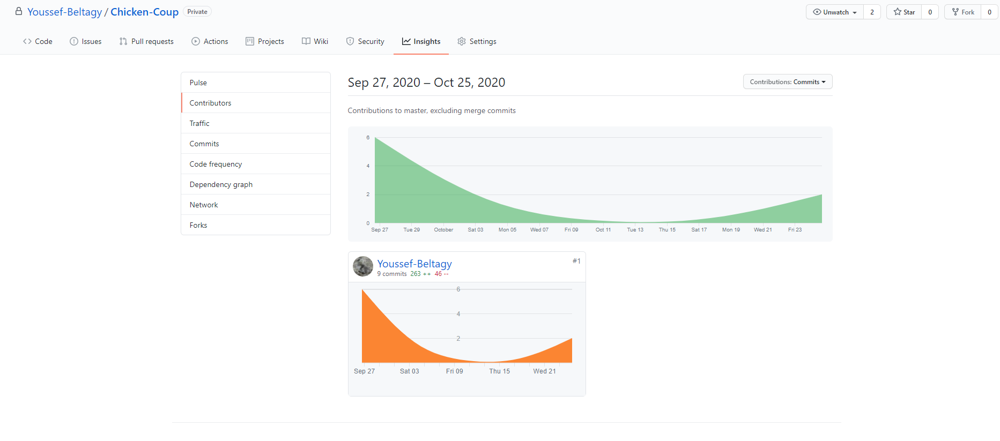

# Progress Report 1

Date: 10/25/2020
To: CSS 422, Autumn 2020
From: Youssef Beltagy
Subject: Implemented NOP and hex-string to long subroutines

---

The first progress report written by the chickens in Chicken Coup.

## Work Completed:

We wrote our design [document](https://chicken-coup.ybeltagy.com). It contains a flow chart, design documentation, coding guidelines, and style guidelines.

We split the program into subroutines, one for every op-code, and a main loop that decides which subroutine to call.

We implemented a string to long subroutine to parse the user's input. We implemented the main loop with error handling but without the required pauses when the screen fills up. We also implemented the NOP opcode subroutine.

## Problems:

We discovered that the disassembler's DS directive can start a long from an odd index. It is implemented incorrectly. This causes the program to break if we try to access the long inside a variable because it is illegal to access a word with an odd index.

There is no JSR with conditions. We realized this after implementing the NOP subroutine. If we don't find a solution, we may end up branching and then calling a subroutine.

## Work Scheduled:

Since we have a working main, our priority is to write more op-code subroutines. For next week, we chose the following opcodes because they don't have addressing modes. They should be easy to implement.

We haven't though much farther ahead. We will meet on Monday (10/26/2020).

1. Test the main loop more
2. Implement RTS subroutine
3. Implement JSR subroutine
4. Implement BRA
5. Implement BCC 

 

## Evaluation:

It felt weird to just past a screen shot, so I explained a little.

This time, I'm (Youssef Beltagy) the only one who contributed. This is okay for now because we wanted to get a main loop up and running to organize the other op-codes around it. The other members got delayed because of HW2 as well.

The number of commits on Github is exaggerated because it includes things like pdf resources that I downloaded from canvas. 

